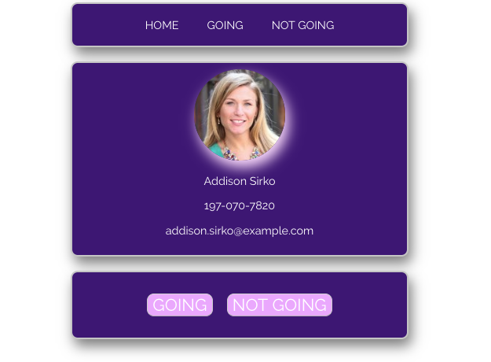

# Invite-Fullstack

## Challenges I Faced? 

Because of previous projects I knew the data calls and routes going into it could prove to be tricky. The concept seems simple enough but execution is an entirely different matter.  

## How Did I Over Come Those Challenges?

I first started off by clearly defining what I wanted to happen in the application, I knew that I wanted to display a random user on the screen every time I refreshed and that when I clicked going or not going it would then move those objects in to their respective arrays. As I suspected the data calls and routes took a little research but through collaboration with my peers and leveraging online resources I was able to pull together this project. 

## What Did I Learn? 

* Use Ajax to call your express application and display a data object 
* Create and find the routes 
* Reinforce JavaScript concepts 
* Sharpened CSS skills
* Setting up a database 
* Working with and NPM modules

